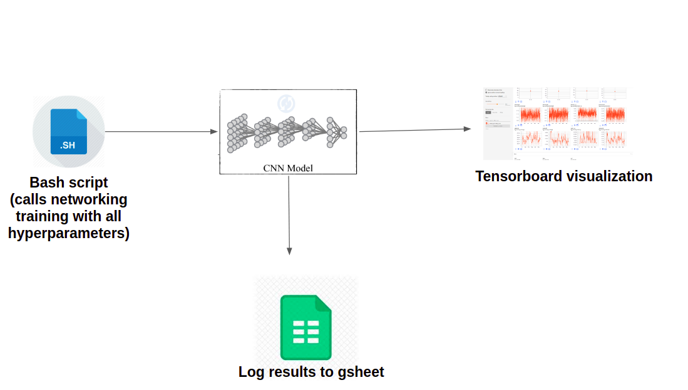

## Description
This folder contains code for training a goal recogniser network. The goal
recogniser network checks if two states are the same. For more details on the
network, feel free to read the original [paper](https://pathak22.github.io/zeroshot-imitation/resources/iclr18.pdf)

## Library requirements
All python libraries required are listed in requirements.txt at the base of the repository.
The pytthon version should be greater than 3.5

## How to run
1. Download the dataset for the rope manipulation from this [github repo](https://github.com/pathak22/zeroshot-imitation)
2. Create the dataset using label_id_generator.py. You will need to change the dataset path 
   specified in the script to the dataset path in your PC
3. Once the dataset is created, you can start network training using goal_recogniser.py script. But this script
   takes in arguments for the following hyperparameters in order Experiment name(for logging results), seed_no(specified as -1 if a random seed number is to
   be generated), lambda_value, learning_rate. An example command could be `python3 sample_experiment -1 0.5 1e-4`
4. This script logs the results to a gsheet. So you will need to setup up your account with login enabled and place your
   credentials json in the same directory. [This link](https://www.twilio.com/blog/2017/02/an-easy-way-to-read-and-write-to-a-google-spreadsheet-in-python.html) should
   help you set that up. Incase, you find it difficult to enable this or you don't want this logging, you can disable this by commenting out the last few lines
   in the goal recongniser file
5. An overall workflow of network training is shown below

